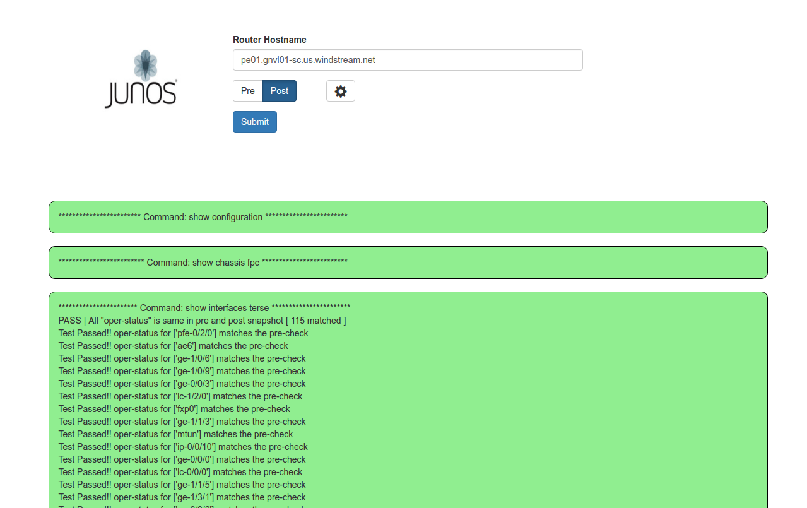

# jsnapy_flask
Flask web app for Juniper JSNAPy (Junos Snapshot Administrator).  Allows you to take a before and after snapshot to be used for verifying services after making a change to a Juniper device. 

*Only tested on Ubuntu/Debian-based Linux distros.*

 

 
 
 

### 1. Requires python2.7, Flask, flask-wtf, & jsnapy (and their dependencies)
`sudo apt-get install build-essential libssl-dev libffi-dev python-dev`  
`sudo -H /usr/bin/pip install jsnapy`  
`sudo -H /usr/bin/pip install Flask`  
`sudo -H /usr/bin/pip install flask-wtf`  

### 2. After install do one of the following:
   * Copy the yaml files from the `./scripts/jsnapy_flask/testfiles` direcotry to `/etc/jsnapy/testfiles/`
   * Edit `/etc/jsnapy/jsnapy.cfg` to point the testfiles directory to where you have `./scripts/jsnapy_flask/testfiles`

### 3. Edit the scripts/jsnapy_flask/device_template.yml file to edit credentials and which testfiles to run.

### 4. To run pre and post change snapshots:
1. Run with `python app.py`
2. Take a pre-change snapshot by entering a hostnaame/IP, selecting Pre, and clicking Submit.
3. Take a post-change snapshot by entering the same hostname/IP, selecting Post, and clicking Submit.
   * Once the post snapshot is complete, it will be compared with the pre-change snapshot and output displayed.
   * Green = All tests passed/skipped
   * Red = A test has failed
   * Grey = All test skipped (nothing found to test)
4. Click on each section to expand
 

#### See also:
Juniper/JSNAPy: 
https://github.com/Juniper/jsnapy

Some test files based on: 
https://github.com/maxdevyatov/jsnapy_examples

Flask tutorial: 
https://github.com/hellt/PLAZA 
http://noshut.ru
